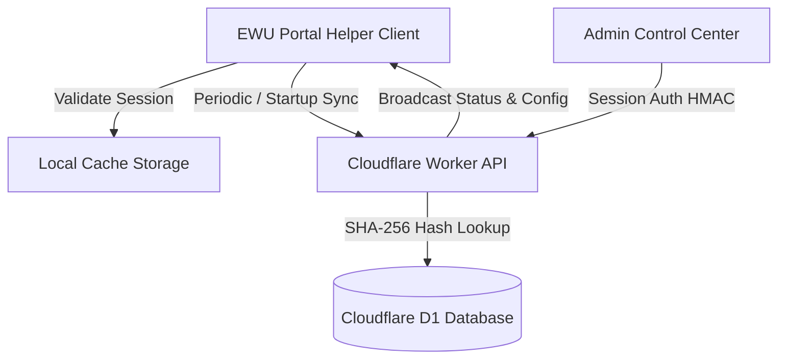

<div align="center">

  

  # ⚡ EWU Buddy — Cyber Command Portal Helper
  ### *The Ultimate Intelligent Student Portal Assistant for East West University*

  <p align="center">
    <a href="https://github.com/starkxxxwiz/ewu-ext"></a>
    <a href="https://github.com/starkxxxwiz/ewu-ext"></a>
    <a href="https://github.com/starkxxxwiz/ewu-ext/commits/main"></a>
    <a href="https://github.com/starkxxxwiz/ewu-ext"></a>
    <a href="https://github.com/starkxxxwiz/ewu-ext"></a>
  </p>

  <p align="center">
    
    
    
    
  </p>

  <p align="center">
    <b>Automate Portal Captchas</b> • <b>10-Column Advising Suite</b> • <b>Ultra-HD Routine Generator</b> • <b>Remote Killswitch &amp; Notices</b> • <b>Device Telemetry</b>
  </p>

</div>

---

## 🌟 Highlights & Key Features

### 🎛️ 1. Cyber Command Settings Popup
* **Clutter-Free Master Page**: Minimalist front view with instant Master Power switch and Status Toast Notification toggles.
* **Segmented Navigation Tabs**: Direct access to dedicated configuration suites for **Advising**, **Courses**, **Routine**, **Login**, and **System** data management.
* **Zero-Latency Loading**: Readily synced from local cache (0ms delay) with instant search filtering.

### 🔑 2. Enterprise License Activation (`activation.html`)
* **Cyber Matrix UI**: Styled with **Plus Jakarta Sans** and **JetBrains Mono** on an ambient glowing glass card.
* **Active State Console**: View license prefix, subscription validity status, and access one-click action buttons:
  * 🌐 **Visit Student Portal**: Direct launch button to `portal.ewubd.edu`.
  * 🔄 **Change License Key**: Seamless in-place key replacement without extension reinstallation.
  * 💬 **Support Link**: Fast channel to Telegram developer support.

### 🛡️ 3. Remote Governance & Admin Control Hub (`/admin`)
* **Emergency Remote Killswitch**: Instant shutdown lock with custom message presets for portal maintenance windows.
* **Global Broadcast Center**: Dispatch Info (Blue), Warning (Amber), and Alert (Red) announcement banners to students.
* **Mandatory Update Enforcer (`update.html`)**: Locks deprecated builds and automatically opens an interactive update tab with release changelogs.
* **Device Telemetry Export**: Download complete activation records in **CSV** and **JSON** formats.
* **Danger Zone Total Purge**: Safeguarded bulk database cleaner with explicit `"DELETE ALL"` verification.

### 📊 4. Portal Suite Capabilities
* **Automatic Captcha Solver**: High-precision arithmetic calculation and automatic submission on portal login.
* **10-Column Advising Assistant**: Seat availability indicators, conflict solver, live credit limits, and offline routine planning.
* **Course Catalog Enhancer**: Sticky table headers, live course filtering, and quick search.
* **Routine & Timetable Generator**: Export high-resolution PNG & PDF routine sheets with custom theme styles.

---

## 🔒 Security & Architecture Overview



| Security Layer | Implementation Details |
| :--- | :--- |
| **Key Generation** | CSPRNG $2^{80}$ entropy bitmask distribution (`& 31`) across 32 Crockford characters |
| **Database Encryption** | Keys hashed via SHA-256 before insertion into Cloudflare D1 |
| **Token Verification** | Signed HMAC-SHA256 device-bound tokens |
| **Admin Hub Auth** | Isolated strictly to `sessionStorage` (auto-destructs on tab/browser close) |
| **Rate Limiting** | 15-minute IP quarantine triggered after 5 consecutive failed activations |

---

## 📁 Repository Structure

```
publish/
├── manifest.json          # Chrome Extension Manifest V3
├── popup.html             # Cybertech Dark settings console
├── popup.js               # Settings logic & tab navigation
├── activation.html        # License activation & management portal
├── activation.js          # License verification & key switcher
├── update.html            # Mandatory update splash landing page
├── update.js              # Update page controller
├── background.js          # Background Service Worker & remote sync
├── content.js             # Core portal module injector & banners
├── pageHook.js            # In-page script interceptor
├── styles.css             # Extension styling & themes
├── icons/                 # Extension icons (16px, 48px, 128px)
├── lib/                   # Vendor libraries (pdf.js, html2canvas, jspdf)
├── backend/               # Cloudflare Serverless Worker & D1 Database
│   ├── worker.js          # API Worker & Admin Hub
│   ├── schema.sql         # D1 database schema
│   └── wrangler.toml      # Wrangler configuration
└── SETUP.md               # Backend deployment & setup guide
```

---

## 🚀 Quickstart & Installation

### Load Unpacked Extension:
1. Clone or download this repository:
   ```bash
   git clone https://github.com/starkxxxwiz/ewu-ext.git
   ```
2. Open Google Chrome and go to `chrome://extensions/`.
3. Toggle **Developer mode** on in the top-right corner.
4. Click **Load unpacked** and select the `/publish` folder.

### Backend Deployment (Cloudflare Worker & D1):
For detailed database migrations and Wrangler deployment steps, check the [`SETUP.md`](./SETUP.md) guide.

---

<div align="center">
  <sub>Crafted with passion for East West University Students. Copyright © 2026 EWU Portal Helper. All rights reserved.</sub>
</div>
